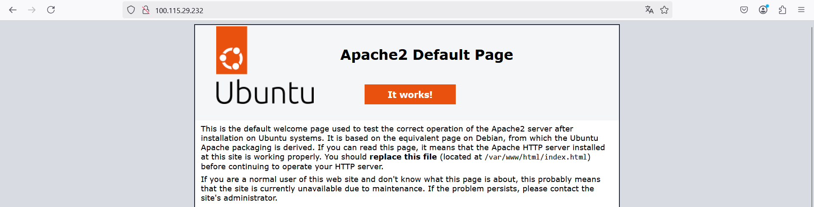

# Compte rendu AP2-1 Etude_Faisabilite_Serveur_Web 

## Serveur LAMP

### Installation du serveur LAMP

Ip, passerelle et DNS de la machine **LAMP** :
```
network:
    ethernets:
        ens160:
            addresses: [100.115.29.232/23]
            routes:
               - to: default
                 via: 100.115.29.254
            nameservers:
                addresses: [100.115.28.41, 100.115.28.42, 8.8.8.8]
            dhcp4: false
            dhcp6: false
    version: 2
```

Mise en place de la base de donnée :

_Pour l'importation de la base de donnée, j'ai copier coller les fichier sql qui servent à créer la base de donnée dans **MYSQL**._

Base de donnée bdHistoStages :

```sql
+--------------------+
| Database           |
+--------------------+
| bdHistoStages      |
| capliez_bd1        |
| information_schema |
| mysql              |
| performance_schema |
| sys                |
+--------------------+

+-------------------------+
| Tables_in_bdHistoStages |
+-------------------------+
| bloc                    |
| categorie               |
| competence              |
| contact                 |
| dept                    |
| etudiant                |
| jouerrole               |
| options                 |
| organisation            |
| periodestage            |
| role                    |
| stage                   |
+-------------------------+

```

Mise en place des fichier du site dans le serveur :

```
stssio@us24init:/var/www/html$ ls
HistostageV1  index.html  Site-Resto.fr
```

Mise en place du site :

_config que j'ai mis dans etc/apache2/sites-available/php-td1.conf_


```
<virtualHost *:80>
     ServerName localhost
     ServerAlias www.HistostageV1
     ServerAdmin webmaster@localhost
     DocumentRoot /var/www/html/HistostageV1
     ErrorLog ${APACHE_LOG_DIR}/error.log
     CustomLog ${APACHE_LOG_DIR}/access.log combined
</VirtualHost>
```


### Teste du serveur LAMP

Résultat des **Ping** vers Google.fr :

```
stssio@us24init:/etc/netplan$ ping www.google.fr
PING forcesafesearch.google.com (216.239.38.120) 56(84) bytes of data.
64 bytes from any-in-2678.1e100.net (216.239.38.120): icmp_seq=1 ttl=110 time=6.96 ms
64 bytes from any-in-2678.1e100.net (216.239.38.120): icmp_seq=2 ttl=110 time=7.10 ms

--- forcesafesearch.google.com ping statistics ---
5 packets transmitted, 5 received, 0% packet loss, time 4005ms
rtt min/avg/max/mdev = 6.963/7.024/7.095/0.048 ms
```
Accès à un site statique HTML :



Accès à une page dynamique PHP :


## Serveur LEPP

### Installation du serveur LEPP

Ip, passerelle et DNS de la machine **LEPP** :

```
network:
    ethernets:
        ens160:
            addresses: [100.115.29.232/23]
            routes:
               - to: default
                 via: 100.115.29.254
            nameservers:
                addresses: [100.115.28.41, 100.115.28.42, 8.8.8.8]
            dhcp4: false
            dhcp6: false
    version: 2
```

Instalation de **Nginx** :

```
sudo apt install nginx -y
```

_On va vérifier si le service Nginx est démarrer_
````
stssio@LEPP:~$ sudo systemctl status nginx
● nginx.service - A high performance web server and a reverse proxy server
     Loaded: loaded (/usr/lib/systemd/system/nginx.service; enabled; preset: en>
     Active: active (running) since Thu 2025-02-27 15:54:29 UTC; 21s ago
````
_On voit bien que le service est bien activé ._

Instalation de **PostgreSQL** :

```
sudo apt install postgresql
```

Instalation de **PHP** :

````
sudo apt install php-fpm
sudo apt install php-cli php-common php-gd php-mbstring php-curl phpxml php-bcmath php-mysql php-curl php-xml php-mbstring php-imagick php-zip php-gd
````

_Je copie le dossier histostage dans /var/www ._

_Dans /etc/nginx/sites-available/defautl, on met le texte si dessous._

````
server { 
    listen 80; 
    server_name HistostageV1 www.HistostageV1; 
    root /var/www/HistostageV1; 
 
    index index.html index.htm index.php; 
 
    location / { 
        try_files $uri $uri/ =404; 
    } 
 
    location ~ \.php$ { 
        include snippets/fastcgi-php.conf; 
        fastcgi_pass unix:/var/run/php/php8.3-fpm.sock; 
     } 
} 
````

### Teste du serveur LEPP

Résultat des **Ping** vers Google.fr :

```
stssio@us24init:/etc/netplan$ ping www.google.fr
PING forcesafesearch.google.com (216.239.38.120) 56(84) bytes of data.
64 bytes from any-in-2678.1e100.net (216.239.38.120): icmp_seq=1 ttl=110 time=6.96 ms
64 bytes from any-in-2678.1e100.net (216.239.38.120): icmp_seq=2 ttl=110 time=7.10 ms

--- forcesafesearch.google.com ping statistics ---
5 packets transmitted, 5 received, 0% packet loss, time 4005ms
rtt min/avg/max/mdev = 6.963/7.024/7.095/0.048 ms
```

Accès à un site statique HTML :


Accès à une page dynamique PHP :

